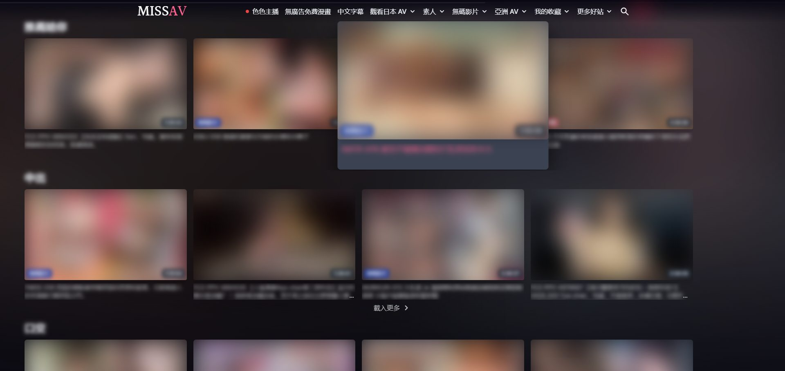
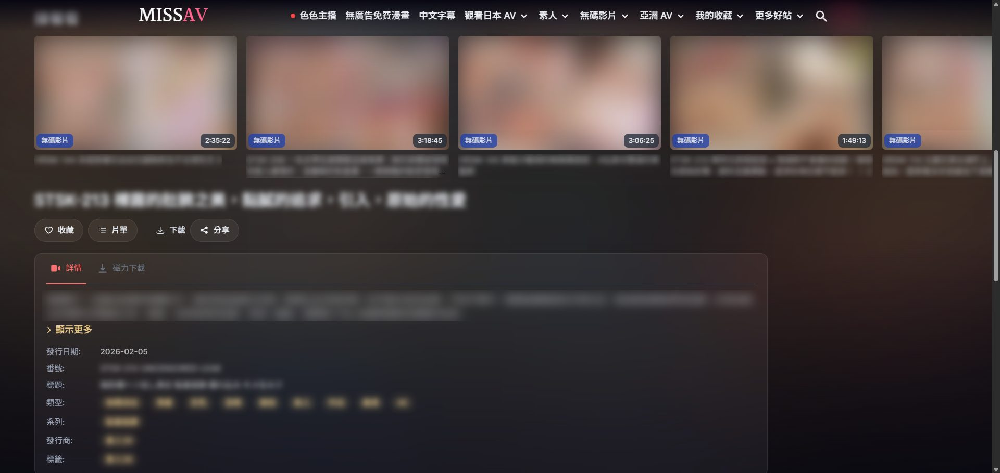
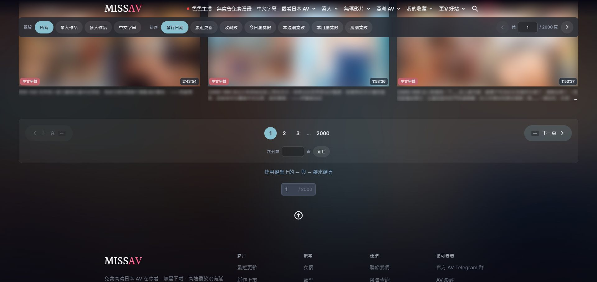
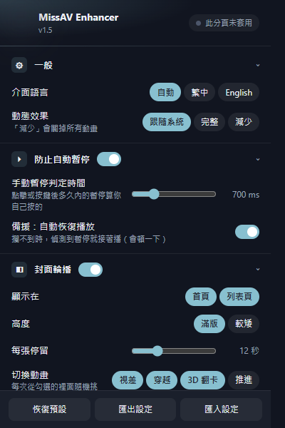

# MissAV Enhancer

**English** | [繁體中文](README.zh-TW.md)

An unofficial Chrome extension (Manifest V3) for **missav.ai** and **missav.ws**. It stops videos from pausing when you switch to another tab or window, and restyles the site for easier browsing. Every feature can be switched and tuned from a toolbar popup.

Not affiliated with the site. No data collection, no remote requests — see [Privacy](#privacy).

<table>
<tr>
<td width="50%"> Home rows (hover zoom)</td>
<td width="50%"> List page: filter and sort chips, mini pager</td>
</tr>
<tr>
<td> Theater video page with ambient light</td>
<td> Up-next row, title, actions and details</td>
</tr>
<tr>
<td> List pagination</td>
<td align="center"> Settings popup</td>
</tr>
</table>

Screenshots at 1920×910 (a maximised Chrome window on a 1080p screen). Covers, previews and titles are blurred.

## Features

- **No auto-pause**: playback keeps going through `Alt+Tab`, `Ctrl+Tab`, and clicks into another window. Pausing it yourself (the player button, spacebar) still works.
- **Cover carousel**: a full-screen hero at the top of the home page, `/dm<n>/*`, `/saved` and the watch history that cycles through that page's own videos. Each slide shows a blurred cover backdrop, a cover that crossfades into the muted preview clip, the title, prev/next buttons, a progress bar, and a random transition (parallax, zoom or 3D flip). The page background takes its tint from the current cover. *HD previews* (on by default, can be turned off) replace the 320×180 clip with a quick-cut montage of the full video at 480p/720p — about 1.3 s from each of 8 spots picked from the video's scrub thumbnails; when a video's stream cannot be found, or has not started within the wait limit (3 s by default, adjustable in the settings), it falls back to the normal clip.
- **Home rows**: the home page's sections become Netflix-style horizontal rows, with scroll-snap, a peek of the next card, arrows, ←/→ between cards, and cards that enlarge on hover.
- **List toolbar**: the filter and sort dropdowns become always-visible chips (one click instead of two), sticky under the header, with a mini pager.
- **List pagination**: large prev/next buttons, page numbers centred on the current page, a jump-to-page box, and ←/→ to change pages.
- **Actresses**: your saved actresses become a grid of large round avatars that lift on hover; an actress's own page gets a cleaner profile card.
- **Actress, genre and maker indexes**: the actress list and ranking use the same avatar grid (the top three ranks in gold), with the sort as chips and tidier filters; genres and makers become a grid of cards.
- **Search**: search results get the list-page treatment, and the search bar becomes a single rounded bar.
- **Login**: the login, sign-up and password dialogs are restyled, and pages that need an account show a clear sign-in card.
- **History and playlists**: the watch history gets the carousel, wide grid and pagination of the other lists; your playlists become a grid of cards, and a playlist's videos become panels with a larger thumbnail and a tidier comment box. On a video page, the playlist panel is restyled to match.
- **Theater video page**: the player fills a full-width band sized to the window height, lit by a blurred glow from the video's own cover. The up-next list becomes a scrolling row right under it.
- **Edge-to-edge layout, scroll reveal, ad hiding.**

## Install

Chrome 111 or newer (Edge and other Chromium browsers work too).

1. Download the latest `missav-enhancer-*.zip` from [Releases](../../releases) and unzip it somewhere permanent. Chrome loads the extension from that folder, so don't delete it afterwards.
2. Open `chrome://extensions` and turn on **Developer mode** (top right).
3. Click **Load unpacked** and select the unzipped folder (the one that contains `manifest.json`).

Or clone this repository and load its directory instead. There is no build step.

### Updating

An extension loaded this way does **not** update itself. To update, download the new release, replace the folder's contents, then click the reload icon on the extension's card in `chrome://extensions` and reload any open tabs. Your settings are kept.

## Settings

Click the toolbar icon (pin it from the puzzle-piece menu first). The popup is in Traditional Chinese or English, following the browser's language. Each group (anti auto-pause, cover carousel, home page, list pages, video page, look and motion, ads) has a master switch and its own options. Changes apply to open tabs immediately; the few that restructure a page are marked and offer a reload. Settings sync across browsers signed in to the same account, and can be reset, exported and imported as JSON.

## Privacy

- The only permission is `storage`, used for your settings (`chrome.storage.sync`) and, for HD previews, a local cache of each video's stream address and picked clips (`chrome.storage.local`).
- Host access is limited to `missav.ai` and `missav.ws`.
- There is no background script. The carousel is built from video cards already on the page. With HD previews on, the extension also requests each carousel video's page on the same site (to find its stream), that video's scrub thumbnails and the stream itself from the site's video CDN — the same requests the site's own player makes. Turn HD previews off and it makes no requests of its own.
- No analytics or tracking.

## Other domains

The site moves between domains. To add one, edit `manifest.json` in **three** places: `host_permissions`, and the `matches` of both `content_scripts` entries. Then reload the extension. Missing one makes the extension half-work. Optionally, also add the domain to the `SITE` regex in `popup.js`; it only drives the popup's "on this site" indicator.

If a new official domain shows up, an issue or PR is welcome.

## When it stops working

The extension depends on the site's internal markup and its `player` global. When the site changes either, features stop working silently. Please [open an issue](../../issues/new/choose) with the domain, the page type (home / list / video) and your Chrome version.

## How it works

The site's pause handlers (`window` blur, `document` blur, `visibilitychange`) all call `window.player.pause()`, where `window.player` is a [Plyr](https://plyr.io/) instance. Instead of blocking those events, which would break unrelated page features, `anti-pause.js` runs in the page's main world at `document_start`, installs an accessor on `window.player` before the page assigns it, and wraps that instance's `pause`. A pause is allowed only if a click, key press or touch happened within the last 700 ms (adjustable), so your own pauses pass and focus-driven ones are dropped. A fallback resumes playback if something calls `pause()` on the `<video>` directly.

The restyle is plain CSS scoped under classes on `<html>`, plus scripts that mark elements, insert their own nodes and measure. They never write `display` on elements Alpine.js controls. [`CLAUDE.md`](CLAUDE.md) has the full architecture notes and a Console procedure for diagnosing regressions.

| File | World | Timing | Purpose |
|---|---|---|---|
| `anti-pause.js` | `MAIN` | `document_start` | Intercepts `window.player.pause()` |
| `settings.js` | isolated | `document_end` | Settings from `chrome.storage.sync` (shared with the popup) |
| `pages.js` | isolated | `document_end` | Page detection (home / list / video) |
| `hd.js` | isolated | `document_end` | HD previews: finds the stream, picks clips, plays the montage |
| `hero.js` | isolated | `document_end` | Cover carousel |
| `browse.js` + `browse.css` | isolated | `document_end` | Layout, rows, list toolbar and pagination, video page, scroll reveal |
| `popup.html` / `.css` / `.js` | — | — | Settings popup |

## License

[MIT](LICENSE)
